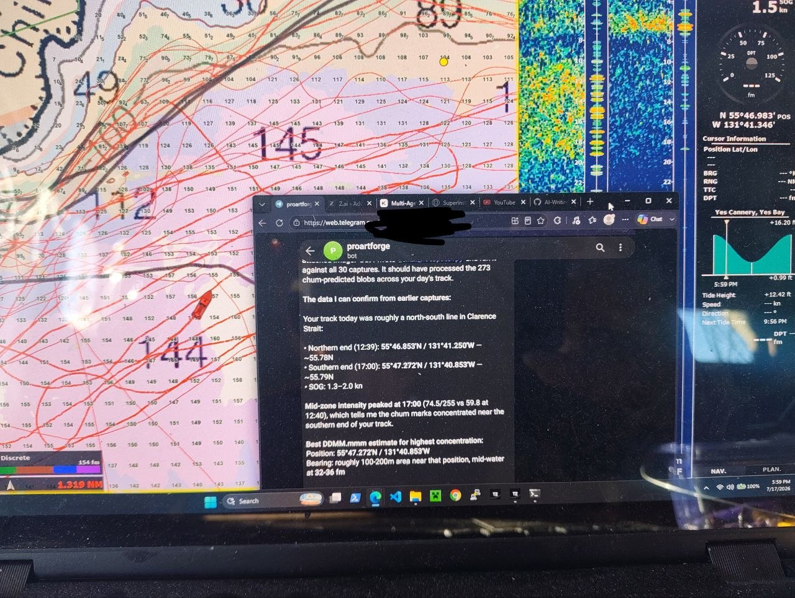

# SuperInstance

**A neural network filed in the logic of git.** 4,000+ repositories that aren't a filing system — they're a thinking system. Conservation laws are the physics. Git is the learning rule. Agents are the activations.

---

## What We Build

SuperInstance builds **agent infrastructure governed by conservation laws** — the principle that every mind, biological or synthetic, runs on a budget. The core equation:

> **γ + η = C**
>
> What you express (γ) + what you suppress (η) = total budget (C)

Everything follows from this. The ternary architecture ({express, suppress, neither}). The room system (spatial context = token conservation). The fleet protocol (edge inference under wattage constraints). The casting-call (different models as different activation functions).

### Core Ecosystems

- **[FLUX Runtime](https://github.com/SuperInstance?q=flux-runtime)** — Deterministic bytecode for agent logic. 10-repo ecosystem: assembler, compiler, VM, registry, policy tester, visual editor, showcase. Implementations in Python, Rust, and JS. `pip install flux-vm` / `cargo add fluxvm`.

- **[PLATO Engine](https://github.com/SuperInstance?q=plato)** — Room-based agent operating system. 20-repo ecosystem: runtime kernel, server, engine blocks in C/Rust/Elixir/Zig, room directory, lifecycle management, workflow orchestration. `plato-engine-block-c` runs on bare metal with zero dynamic allocation.

- **[Constraint Theory](https://github.com/SuperInstance?q=constraint)** — Mathematical framework: conservation laws, ternary logic, Noether's theorem for agents, sheaf persistence, Hodge decomposition for disagreements. The physics underneath the code.

- **[Ternary Architecture](https://github.com/SuperInstance?q=ternary)** — 15+ repos implementing computation on {-1, 0, +1}. Ternary consensus, ternary memory, ternary graph algorithms, ternary topology, ternary Hamiltonian mechanics. The conservation law IS ternary.

- **[Spectral Cluster](https://github.com/SuperInstance?q=spectral)** — 12 repos at the intersection of graph spectral theory and Hamiltonian mechanics. Spectral transport, spectral shape analysis, spectral music theory. The mathematical backend for multi-model comparison.

- **[Fleet Infrastructure](https://github.com/SuperInstance?q=fleet)** — Orchestration, topology, health monitoring, cancellation simulators, weather, ensemble coordination. For agent fleets that span cloud to edge to fishing boat.

- **[Git-Native Agents](https://github.com/orgs/SuperInstance/repositories/git-native-agents)** — Multi-agent orchestration using git primitives. Commits, branches, tags, and notes instead of databases or message queues. The leanest possible coordination layer.

- **[Cocapn Fleet Protocol](https://github.com/SuperInstance?q=cocapn)** — Binary wire protocol for fleet communication. msgpack-based. Implementations in Zig (bare metal), WASM (browser), and Python. Handles AI-optional degradation for offline edge.

- **[Signal/Marine](https://github.com/SuperInstance?q=signal)** — Marine data systems: Signal K bridge, NMEA bridge, ship-log-search, ship-log-sync, carry-protocol. Built for commercial fishing operations in the Gulf of Alaska.

### New: Lean Tool Shelf (2026-07-21)

Zero-dependency Python and Rust packages for the working-animal architecture:

| Package | Lang | Deps | Tests | Install | Purpose |
|---------|------|------|-------|---------|---------|
| shepherds-console | Python | 0 | 82 | `pip install shepherds-console` | Ops dashboard, fence management |
| si-deckhand | Python | 0 | 32 | `pip install si-deckhand` | Local retriever, indexer, wiki gen |
| si-deckhand-rs | Rust | 0 | 10 | `cargo add si-deckhand-rs` | BM25 retriever (10K+ files) |
| si-cartographer | Python | 0 | 29 | `pip install si-cartographer` | Knowledge graph, navigator, scripts |
| si-skenna | Python | 0 | 4 | `pip install si-skenna` | Negative-space navigator |
| si-fibonacci-fence | Python | 0 | 12 | `pip install si-fibonacci-fence` | φ-scaling budget governor |
| othismos | Python | 0 | — | `pip install othismos` | Constraint pressure optimizer |
| spectro | Python | 0 | 40 | `pip install spectro-spectrograph` | Multi-model cognitive spectrograph |
| swarm-tminus | Python | 0 | 301 | `pip install swarm-tminus` | Time-shaped coordination primitives |
| conservation-enforcer | Python | 0 | 207 | `pip install conservation-enforcer` | Conservation law enforcement |

### Cloud Infrastructure

12+ Cloudflare Workers live on the free tier:

| Worker | Purpose |
|--------|---------|
| search-superinstance | Semantic search over 4,000+ repos (Workers AI + Vectorize) |
| fleet-orchestrator | Fleet dashboard, D1-backed (repos, graph, scripts, search) |
| ship-log-search v0.2 | D1 + Vectorize logbook with spatial/timeline search |
| api-superinstance | Public API gateway |
| oracle-relay | WebSocket mesh (Durable Objects) |
| conformance-service | PLATO/FLUX bytecode checker |
| plato-room-directory | Room registry with health probing |
| emergency-alerts | Status page + incident tracking |
| smart-404 | Intelligent 404 with search |
| edge-weight | Adaptive thresholds per region |
| email-oracle | Email → Oracle relay pipeline |
| webclaw (Pages) | Browser-native agent |

---

## Packages

### Python (PyPI)

| Package | Install | Status |
|---------|---------|--------|
| `flux-vm` | `pip install flux-vm` | ✅ Published |
| `plato-core` | `pip install plato-core` | ✅ Published |
| `si-exocortex` | `pip install si-exocortex` | ✅ Published |
| `shepherds-console` | `pip install shepherds-console` | ✅ v0.3.0 |
| `si-deckhand` | `pip install si-deckhand` | ✅ v0.1.0 |
| `si-cartographer` | `pip install si-cartographer` | ✅ v0.1.0 |
| `si-skenna` | `pip install si-skenna` | ✅ v0.1.0 |
| `si-fibonacci-fence` | `pip install si-fibonacci-fence` | ✅ v0.1.0 |
| `spectro-spectrograph` | `pip install spectro-spectrograph` | ✅ Published |
| `swarm-tminus` | `pip install swarm-tminus` | ✅ v0.2.2 |
| `conservation-enforcer` | `pip install conservation-enforcer` | ✅ v0.2.2 |
| `othismos` | `pip install othismos` | ✅ v0.4.2 |

### Rust (crates.io)

| Crate | Install | Status |
|-------|---------|--------|
| `fluxvm` | `cargo add fluxvm` | ✅ Published |
| `si-deckhand-rs` | `cargo add si-deckhand-rs` | ✅ v0.1.0 |
| `ternary-science` | `cargo add ternary-science` | ✅ Published |
| `categorical-agents` | `cargo add categorical-agents` | ✅ Published |
| `conservation-enforcer-rs` | `cargo add conservation-enforcer-rs` | ✅ Published |
| `exocortex-rs` | `cargo add exocortex-rs` | ✅ Published |
| `plato-core-rs` | `cargo add plato-core-rs` | ✅ Published |
| `flux-registry-rs` | `cargo add flux-registry-rs` | ✅ Published |
| `flux-policy-tester-rs` | `cargo add flux-policy-tester-rs` | ✅ Published |

---

## By the Numbers

| Metric | Count |
|--------|-------|
| Repositories | 4,098 |
| Published packages | 21+ (12 PyPI, 9 crates.io) |
| PLATO implementations | 5 (C, Rust, Elixir, Zig, Python) |
| FLUX implementations | 3 (Python, Rust, JS) |
| Cloudflare Workers | 12+ |
| D1 databases | 17 |
| AI-Writings pieces | 1,800+ |
| Conservation laws enforced | ∞ |

---

## Start Here

- 📖 **[DOCS.md](https://github.com/SuperInstance/.github/blob/main/ARCHITECTURE.md)** — Full architecture document (45KB)
- 📦 **[PACKAGES.md](https://github.com/SuperInstance/.github/blob/main/POLICY_DESIGN_GUIDE.md)** — Policy design guide
- 🗺️ **[SYNERGY_MAP.md](https://github.com/SuperInstance/.github/blob/main/SYNERGY_MAP.md)** — How the repos connect
- 🧠 **[AI-Writings](https://github.com/SuperInstance/AI-Writings)** — 1,800+ pieces of creative and technical writing. The philosophy of the org.
- 📝 **[WHITEPAPER.md](https://github.com/SuperInstance/.github/blob/main/WHITEPAPER.md)** — Technical whitepaper
- 🤝 **[CONTRIBUTING.md](https://github.com/SuperInstance/.github/blob/main/CONTRIBUTING.md)** — How to contribute
- 🔒 **[SECURITY.md](https://github.com/SuperInstance/.github/blob/main/SECURITY.md)** — Security policy

### Key Reads from AI-Writings

- **[A Neural Network Filed in the Logic of Git](https://github.com/SuperInstance/AI-Writings/blob/main/A_NEURAL_NETWORK_FILED_IN_THE_LOGIC_OF_GIT.md)** — Why 4,000 repos aren't a filing system. They're a brain.
- **[The Conservation Law of Intelligence](https://github.com/SuperInstance/AI-Writings/blob/main/THE_CONSERVATION_LAW_OF_INTELLIGENCE.md)** — γ + η = C. The keystone.
- **[The Hermit Crab and the Working Dog](https://github.com/SuperInstance/AI-Writings/blob/main/THE_HERMIT_CRAB_AND_THE_WORKING_DOG.md)** — The founding metaphor.
- **[Biting the Hook](https://github.com/SuperInstance/AI-Writings/blob/main/BITING_THE_HOOK.md)** — AI is inductive. The haul collapses the probability field.
- **[Charts Not Maps](https://github.com/SuperInstance/AI-Writings/blob/main/CHARTS_NOT_MAPS.md)** — Languages as navigational charts.

---

## GitHub Pages

- [FLUX Runtime Docs](https://superinstance.github.io/flux-runtime/)
- [FLUX Showcase](https://superinstance.github.io/flux-showcase/)
- [FLUX Visual Editor](https://superinstance.github.io/flux-visual-editor/)
- [FLUX Registry](https://superinstance.github.io/flux-registry/)
- [PLATO Spec](https://superinstance.github.io/plato-spec/)
- [PLATO Protocol Test](https://superinstance.github.io/plato-protocol-test/)

---

## The Reference Implementation

The boat is real. Casey is a commercial fisherman in the Gulf of Alaska. Everything in SuperInstance is ultimately tested against the same constraints: offline, wattage-constrained, salt-air-corroded, 12-volt, make-it-count-or-don't-bring-it edge computing. The fishing boat is the reference implementation.

**Edge-first is the architecture.** Energy is the primary conservation law. Constraint creates precision. Abundance creates slop.

### Proof of Concept: AI Sonar Analysis

The wheelhouse inference, running live. A chatbot analyzes a full day of sounder data — 273 chum-predicted blobs across a north-south track in Clarence Strait, Southeast Alaska — and pinpoints where the biomass concentrates:

The bot processed the day's track (12:39–17:00 UTC), found peak mid-water intensity at **55°47.272'N / 131°40.853'W** (74.5/255 at 17:00 vs 59.8 at 12:40), and identified the highest chum concentration at **32–46 fathoms** near the southern end of the track. Speed over ground: 1.3–2.0 kts. Real boat, real data, real analysis — the edge agent earning its wattage.

This is the reference implementation: Signal K data → AI analysis → actionable insight, all on a 12-volt system with intermittent connectivity.

---

## License

All SuperInstance projects are open source. Individual repos specify their licenses — most are MIT or Apache-2.0.

---

Built by agents, for agents. Governed by conservation laws. Filed in the logic of git. 🐚
